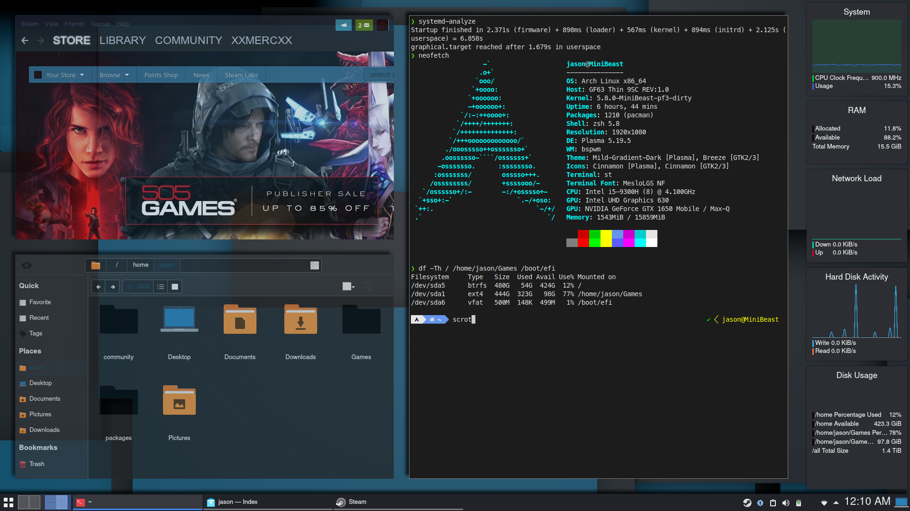

# **config-files**
### *personal config files for my Arch Linux*
___
- **bspwmrc** *-bspwm config*  
`~/.config/bspwm/bspwmrc` 
 
- **sxhkdrc** *-sxhkd hotkey config*  
`~/.config/sxhkd/sxhkdrc`

- **sxhkd-cheatsheet** *-cheatsheet for my hotkeys*  
`~/.config/sxhkd/sxhkd-cheatsheet`

- **picom.conf** *-picom compositor config*  
`~/.config/picom/picom.conf`

- **.zshrc**1 *-z shell config w/ powerlevel10k* (Must have [powerlevel10k](https://github.com/romkatv/powerlevel10k))    
`~/.zshrc`

- **plasma-bspwm.desktop** *-.desktop to use bspwm in plasma*  
`/usr/share/xsessions/plasma-bspwm.desktop`  
___
### **Do not attempt to use these unless you know what you're doing!**2

- `/etc/makepkg.conf`  
*Compiles packages with -march=native and -O2 flags and uses clang when possible*

- `/etc/mkinitcpio.conf`  
*For generating minimal initramfs. My modules will not be the same as yours.* 
See [Minimal initramfs - ArchWiki](https://wiki.archlinux.org/index.php/Minimal_initramfs)
___
1*.zshrc contains configurations unique to my setup and should not be used as is!*  
2*Seriously, if you break your system by messing around with your mkinitcpio.conf I will laugh at you. You've been warned!*
___

