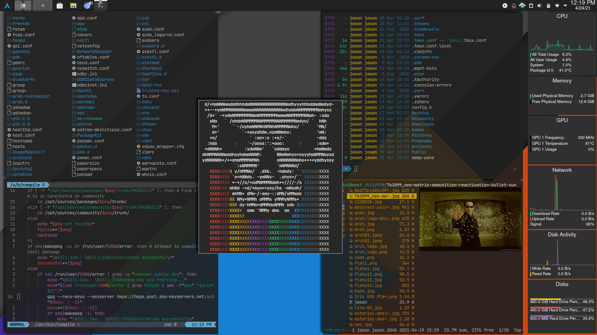
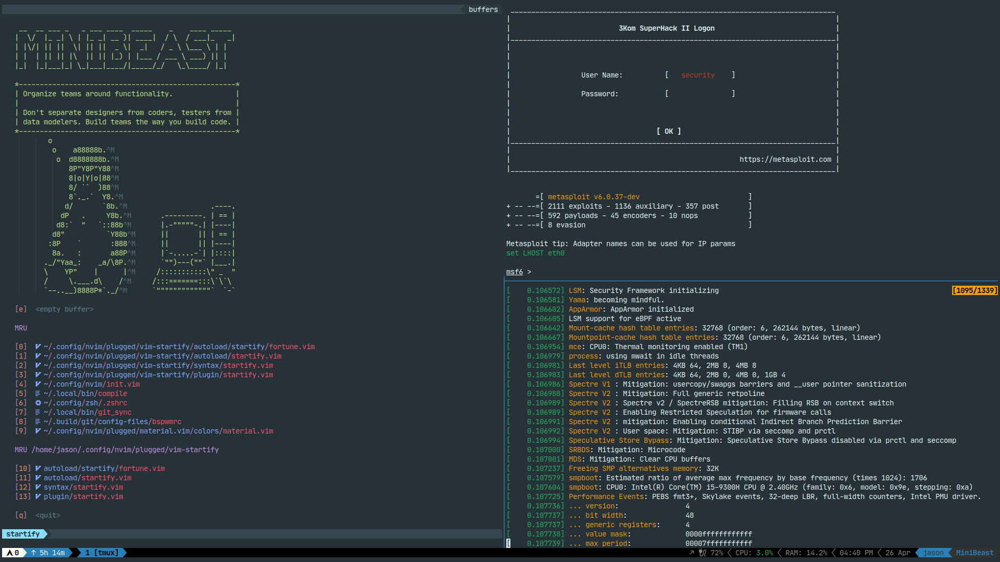
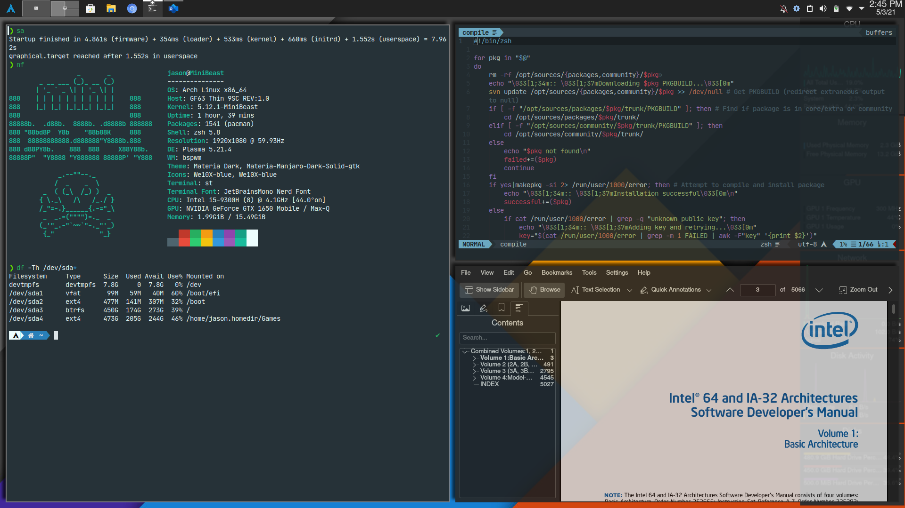

# **config-files**
### *personal config files for my Arch Linux*

#### The files herein exist first and foremost as my backups. I've only made them public incase someone may find them useful.  
___
- **bspwmrc** *-bspwm config*  
`~/.config/bspwm/bspwmrc` 
 
- **sxhkdrc** *-sxhkd hotkey config*  
`~/.config/sxhkd/sxhkdrc`

- **sxhkd-cheatsheet** *-cheatsheet for my hotkeys*  
`~/.config/sxhkd/sxhkd-cheatsheet`

- **picom.conf** *-picom compositor config*  
`~/.config/picom/picom.conf`

- **.zshrc**1 *-z shell config w/ powerlevel10k* (Must have [powerlevel10k](https://github.com/romkatv/powerlevel10k))  
`~/.zshrc`

- **init.vim** *-vim configuration*  
`~/.config/nvim/init.vim`

- **fortune.vim** *-vim startpage config, hostname is retrieved from hostname command (requires figlet)*  
`~/.config/nvim/plugged/vim-startify/autoload/startify/fortune.vim`

- **unbound.conf** *-Uses Cloudflare's DNS over TLS for encrypted DNS queries*  
`/etc/unbound/unbound.conf`

- **plasma-bspwm.desktop** *-.desktop to provide a session in which plasma uses bspwm instead of kwin*  
`/usr/share/xsessions/plasma-bspwm.desktop`  

- **.tmux.conf && .tmux.local.conf** *-[gpackosz/.tmux](https://github.com/gpakosz/.tmux)*  
`~/.tmux.conf` && `~/.tmux.conf.local`  

___
### **Do not attempt to use these unless you know what you're doing!**2

- `/etc/makepkg.conf`  
*Compiles packages with -march=native, -o3 and flto=auto [Link time optimization](https://www.phoronix.com/scan.php?page=news_item&px=OpenSUSE-Tumbleweed-LTO) flags*

- `/etc/mkinitcpio.conf` && `/etc/dracut.conf.d/MiniBeast-dracut.conf`  
*For generating a minimal initramfs for a system with a specific, known and static hardware configuration. My hooks/modules will not be the same as yours.*   
See [Minimal initramfs - ArchWiki](https://wiki.archlinux.org/index.php/Minimal_initramfs)

- `/etc/hosts`  
*My hosts file blocks traffic from over 59,000 different sites known to contain or distribute adware/malware.*  

- `/usr/bin/compile`  
A script I made to automate compiling multiple packages with the Arch Build System. Automatically adds keys with gpg using an https server as well. You must make the directory /opt/sources (or change it in the script) then run `svn checkout --depth=empty svn://svn.archlinux.org/{packages,community}` inside of the directory.  
Usage: `compile pkg1 pkg2 pkg3`  

___
1*.zshrc contains configurations unique to my setup and should not be used as is!*  
2*Seriously, if you break your system by editing your mkinitcpio.conf... I will laugh at you. You've been warned!*
___
