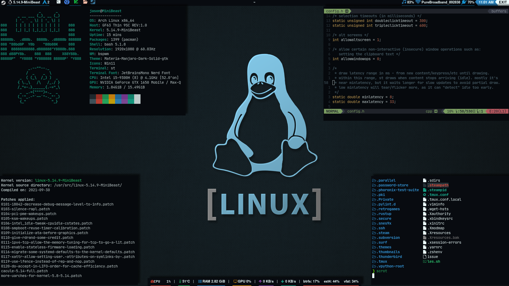

# **config-files**

## *personal config files for my Arch Linux*

*The files herein exist first and foremost as my backups. I've only made them public incase someone may find them useful.*  
___

- **bspwm** *-bspwm config files*  
`~/.config/bspwm/bspwmrc`

- **sxhkd** *-sxhkd hotkey config files*  
`~/.config/sxhkd/sxhkdrc`

- **picom** *-picom compositor config files*  
`~/.config/picom/picom.conf`

- **nvim** *-neovim configuration files* (init.vim sourced from [Optixal/neovim-init.vim](https://github.com/Optixal/neovim-init.vim))  
`~/.config/nvim/init.vim`

- **unbound.conf** *-Uses Cloudflare's DNS over TLS for encrypted DNS queries*  
`/etc/unbound/unbound.conf`

- **plasma-bspwm.desktop && plasma-kwin_x11.service** *-.desktop to provide a session in which plasma uses bspwm instead of kwin and systemd service file for plasma systemd startup to still use bspwm.*  
`/usr/share/xsessions/plasma-bspwm.desktop`  
`/usr/lib/systemd/user/plasma-kwin_x11.service`  

- **.tmux.conf && .tmux.local.conf** (Sourced from [gpackosz/.tmux](https://github.com/gpakosz/.tmux))  
`~/.tmux.conf` && `~/.tmux.conf.local`  

- **zsh** *-All my zsh config files*  
  *p10k.zsh*  -Powerlevel10k config  
  *zshrc* -Z Shell config file  
  *zsh_aliases* -Aliases file  
  *zsh_functions* -Functions file  
`~/.config/zsh/`

___

### **Do not attempt to use these unless you know what you're doing!**2

- `/etc/makepkg.conf`  
*Compiles packages with -march=native, -o3 and flto=auto [Link time optimization](https://www.phoronix.com/scan.php?page=news_item&px=OpenSUSE-Tumbleweed-LTO) flags*

- `/etc/mkinitcpio.conf` && `/etc/dracut.conf.d/MiniBeast-dracut.conf`  
*For generating a minimal initramfs for a system with a specific, known and static hardware configuration. My hooks/modules will not be the same as yours.*  
See [Minimal initramfs - ArchWiki](https://wiki.archlinux.org/index.php/Minimal_initramfs)

- `/etc/hosts`  
*My hosts file blocks traffic from over 59,000 different sites known to contain or distribute adware/malware.*  

- `~/.local/bin/kernel_install` && `~/.local/bin/kernel_remove`  
*Scripts that I made to download, configure, install and remove kernels on my system*  

___
1*.zshrc contains configurations unique to my setup and should not be used as is!*  
2*Seriously, if you break your system by editing your mkinitcpio.conf... I will laugh at you. You've been warned!*
___
